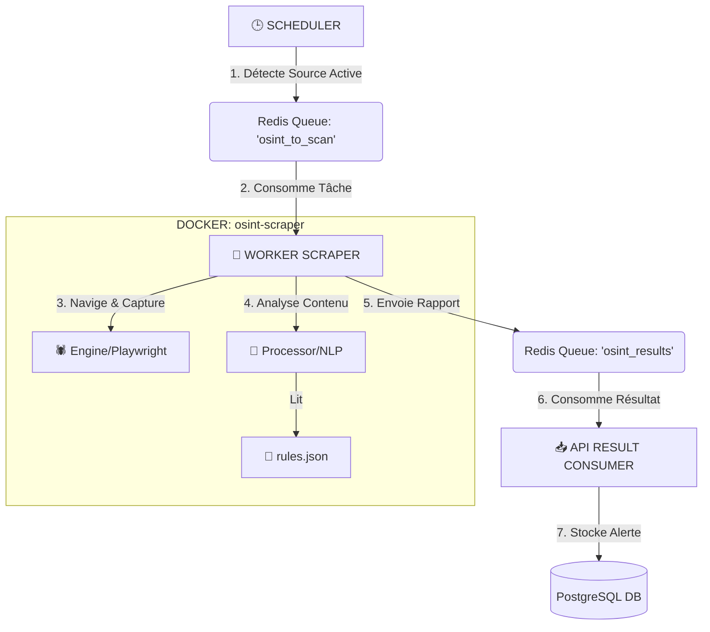

# ARCHITECTURE TECHNIQUE : SCRAPING AUTOMATIQUE (LOT 4)

Ce document détaille le fonctionnement interne du moteur de surveillance automatique déployé sur **OSINT-SCOUT & SHIELD**.

---

## 1. VUE D'ENSEMBLE (Le Flux de Données)

Le système fonctionne en **boucle continue** (Architecture "Event-Driven" pilotée par événements via Redis).

---

## 2. COMPOSANTS & FICHIERS CLÉS

Voici la liste exhaustive des fichiers qui font tourner cette machine, classés par étape du processus.

### ÉTAPE 1 : L'ORDONNANCEMENT (Le Chef d'Orchestre)
C'est lui qui décide **QUAND** lancer une analyse.
*   **Fichier :** `backend/app/workers/scheduler.py`
*   **Rôle :**
    *   Vérifie chaque minute la base de données (`monitoring_sources`).
    *   Si `dernière_analyse + fréquence < maintenant`, il crée une tâche.
    *   Il pousse un message JSON dans la file Redis `osint_to_scan`.

### ÉTAPE 2 : L'EXÉCUTION (L'Ouvrier)
C'est le conteneur Docker isolé qui fait le travail sale (navigation web).
*   **Fichier Principal :** `scrapers/workers/worker.py`
    *   **Rôle :** Écoute Redis, reçoit la tâche, lance les moteurs, renvoie le résultat.
*   **Moteur de Navigation :** `scrapers/runners/engine.py`
    *   **Rôle :** Contrôle le navigateur, gère les cookies, scroll la page, prend la capture d'écran, calcule le Hash SHA-256.
*   **Moteur d'Analyse :** `scrapers/analysis/processor.py`
    *   **Rôle :** Reçoit le texte brut, le nettoie (NLP), cherche les mots-clés, calcule le Score de Risque.
*   **Configuration :** `scrapers/config/rules.json`
    *   **Rôle :** Contient les règles métier (Ex: "Si mot 'Code' + 'Urgence' = Risque 80").

### ÉTAPE 3 : L'INGESTION & STOCKAGE (Le Greffier)
C'est le retour vers l'application principale pour sauvegarde.
*   **Fichier :** `backend/app/workers/result_consumer.py`
    *   **Rôle :** Écoute le retour du worker.
    *   Si le rapport dit `is_alert: True`, il crée une entrée dans la table `alerts`.
    *   Il met à jour le statut de la tâche (`completed`) dans `scraping_runs`.
*   **Modèles de Données :** `backend/app/models/source.py` & `alert.py`
    *   **Rôle :** Définit la structure des tables SQL (Alertes, Preuves, Runs).

---

## 3. SCÉNARIO DE VIE D'UNE ALERTE

Prenons un exemple concret :
1.  **08:00** : Le `scheduler.py` voit que la source *"Facebook Groupe Vente"* doit être scannée. Il envoie l'ordre.
2.  **08:00:05** : Le `worker.py` reçoit l'ordre. Il appelle `engine.py`.
3.  **08:00:10** : `engine.py` visite la page, prend une capture, extrait le texte : *"Vends iPhone 15, paiement urgent par Mandat uniquement"*.
4.  **08:00:15** : `processor.py` lit ce texte. Il voit les mots "Urgent" et "Mandat" définis dans `rules.json`.
5.  **08:00:16** : Le score calculé est de **85/100**. C'est une alerte.
6.  **08:00:17** : Le Worker envoie le paquet complet (JSON + Preuve Hashée) à l'API.
7.  **08:00:18** : `result_consumer.py` reçoit le paquet, crée l'alerte en base de données.
8.  **08:00:19** : L'alerte apparaît sur votre Dashboard.

---

## 4. COMMENT MODIFIER LE SYSTÈME ?

*   **Pour changer la fréquence de scan** : Modifier la source via l'Interface ou la Base de Données (Table `monitoring_sources`).
*   **Pour affiner la détection** : Modifier le fichier `scrapers/config/rules.json` (Ajouter des mots-clés).
*   **Pour changer la méthode de capture** : Modifier le code Python `scrapers/runners/engine.py`.
