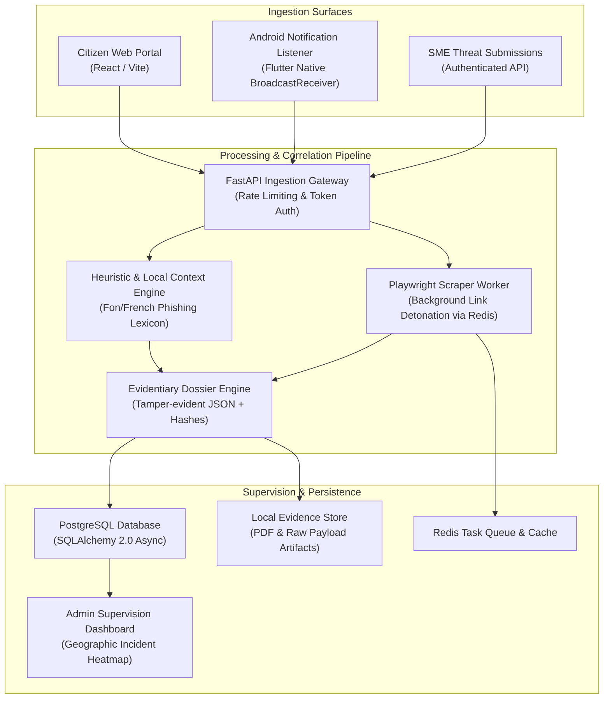

# BENIN CYBER SHIELD (BCS)

**Cross-Surface Mobile Fraud Detection & Triage Platform — Citizen Reporting, SME Brand Defense & Android Telemetry Shield**

[](https://fastapi.tiangolo.com/)
[](https://vitejs.dev/)
[](https://flutter.dev/)
[](https://www.docker.com/)
[](https://opensource.org/licenses/MIT)

---

## 1. Executive Summary

**Benin Cyber Shield (BCS)** is an operational cybersecurity platform engineered to detect, analyze, and mitigate mobile phishing, financial fraud, and SMS/MMS social engineering across Benin. 

Unlike single-purpose detection tools, BCS correlates four distinct operational surfaces around a unified evidentiary pipeline:
1. **Public Citizen Portal**: Unauthenticated suspicious message analysis with dialectal/local context parsing (Fon/French) and formal incident reporting.
2. **National Admin Console**: Centralized supervisory dashboard with geographic risk mapping across 12 departments, incident triage, and evidentiary dossier generation.
3. **SME Brand Defense Workspace**: Dedicated portal for targeted local businesses to monitor active impersonation campaigns and inspect forensic bundles.
4. **Android Telemetry Agent (Flutter)**: A lightweight, passive background listener monitoring mobile notifications in near-real-time with offline queue fallback.

---

## 2. Core Architecture & Data Pipeline



---

## 3. Operational Surfaces

### 3.1 Public Citizen Portal (`/verify`)
- **Instant Message Verification**: Direct text input checking for high-risk mobile money syntax, predatory phishing indicators, and spoofed government domains.
- **Dialectal Understanding**: Detects emerging Beninese financial phishing patterns blending French and local terms.
- **Formal Incident Submission**: Generates a public tracking reference number and packages suspect media attachments.

### 3.2 National Admin Console (`/admin`)
- **Geographic Threat Heatmap**: Department-level distribution of reported scams across Benin.
- **Incident Lifecycle Management**: Status transitions (`PENDING` → `CONFIRMED_SOC` → `TRANSMITTED`).
- **Forensic Dossier Generation**: Automatic assembly of cryptographic hashes, extraction timestamps, and network artifacts into exportable audit records.

### 3.3 SME Workspace (`/pme`)
- **Impersonation Alerts**: Real-time alerts when company brands, phone numbers, or trade names are identified in active citizen reports.
- **Dossier Access**: Instant download of formal legal evidentiary packs for judicial handoff.

### 3.4 Android Mobile Shield (Flutter)
- **Passive Notification Inspection**: Scans inbound push notifications from user-selected communication apps.
- **Local SQLite Audit Trail**: Maintains encrypted offline event logs on-device.
- **Resilient Offline Queue**: Buffers suspect payloads and replays submissions when connectivity resumes.

---

## 4. Key API Endpoints

### Public & Analysis
- `POST /api/v1/analysis/verify` : Analyzes text/SMS payloads and returns risk level (`LOW`, `MEDIUM`, `HIGH`).
- `POST /api/v1/incidents/report` : Submits verified suspect messages into the incident triage pipeline.
- `POST /api/v1/incidents/report-with-media` : Multipart incident intake supporting screenshot attachments.
- `GET /api/v1/map/overview` : Public aggregate stats per administrative department.
- `GET /health` : Liveness and database connectivity probe.

### Mobile Telemetry
- `GET /api/v1/mobile/bootstrap` : Returns active threat signatures and detection configuration.
- `GET /api/v1/mobile/history` : Syncs historical threat statuses for authenticated devices.

### Authenticated Admin & SME Operations
- `POST /api/v1/auth/login` : OAuth2-compatible JWT issuance.
- `GET /api/v1/admin/dashboard` : High-level metrics, active alerts, and triage queues.
- `GET /api/v1/pme/dashboard` : Company-scoped incident metrics and risk alerts.
- `POST /api/v1/shield/actions/dispatch` : Triggers automated mitigation or external simulated transmission.

---

## 5. Local Development & Docker Quickstart

### Prerequisites
- Docker Engine 24+ & Docker Compose v2+
- Flutter SDK 3.10+ (for mobile client compilation)

### 3-Step Setup

```bash
# 1. Clone repository & configure environment
git clone https://github.com/Kreesten-hsh/BENIN-CYBER-SHIELD.git
cd BENIN-CYBER-SHIELD
cp .env.example .env

# 2. Build and launch Docker services
docker compose up -d --build

# 3. Seed demonstration data (Admin, SMEs, and Multi-department incidents)
docker compose exec -T api python scripts/seed_demo_data.py
```

### Access Points
- **Web Applications (Citizen / Admin / SME)**: [http://localhost:5173](http://localhost:5173)
- **API Documentation (Swagger UI)**: [http://localhost:8000/docs](http://localhost:8000/docs)
- **Health Check**: [http://localhost:8000/health](http://localhost:8000/health)

---

## 6. Project Layout

```
BENIN-CYBER-SHIELD/
├── backend/                  # FastAPI REST Service & Core Logic
│   ├── app/
│   │   ├── api/              # Versioned API route handlers
│   │   ├── core/             # Security, JWT, config & database sessions
│   │   ├── models/           # SQLAlchemy 2.0 async ORM entities
│   │   ├── schemas/          # Pydantic validation models
│   │   └── services/         # Dossier generation, heuristics & verification
│   └── tests/                # Automated pytest suite
├── frontend/                 # React 19 + Vite Application
│   ├── src/
│   │   ├── components/       # UI building blocks (Tailwind / Vanilla CSS)
│   │   ├── pages/            # Citizen (/verify), Admin, and SME views
│   │   └── services/         # Axios API client
├── mobile/                   # Flutter Android Application
│   ├── android/              # Native Android NotificationListenerService bindings
│   ├── lib/                  # Dart application logic, state, and UI views
├── scrapers/                 # Playwright worker processes for link detonation
├── evidences_store/          # Serialized forensic evidence artifacts
├── docker-compose.yml        # Multi-service container orchestration
└── .env.example              # Baseline environment configuration template
```

---

## 7. License

Distributed under the MIT License. See `LICENSE` for details.
